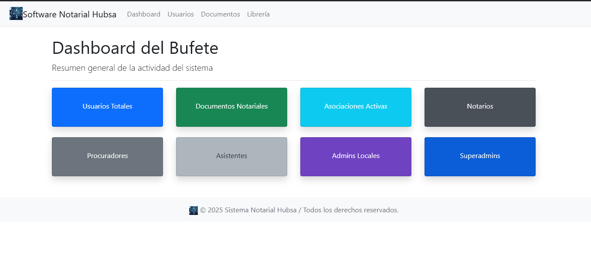

# 📄 Diseño Inicial – Módulo de Seguridad, Login y Roles
**Proyecto:** Software Notarios  
**Fecha:** 05/08/2025  
**Autor:** Giancarlo Figueroa + Tars‑90 🤖  

---

## 🎯 Objetivo General

Implementar un **sistema robusto de autenticación y control de roles** para el Software Notarios, que permita:

1. **Autenticación de usuarios** con manejo de hash seguro de contraseñas.
2. **Control de acceso por roles** (Superadmin, Admin Local, Notario, Procurador, Asistente).
3. **Protección de rutas** según permisos y visualización dinámica de dashboards.
4. **Módulo de auditoría y trazabilidad** integrado, **activado solo para bufetes que lo contraten**.
5. **Escalabilidad futura**:  
   - Seguridad para acceso remoto.  
   - Integración con correo electrónico para verificaciones.  
   - Chatbot Tars‑90 integrado para asistencia a usuarios en módulos 6‑8.

---

## 🔑 Roles y Flujos

1. **Superadmin**  
   - Crea bufetes, asigna planes y feature flags.  
   - Accede a todos los bufetes (navbar con selector de bufete).  
   - Puede ver avisos de pagos, intentos fallidos, alertas de seguridad.  

2. **Admin Local (Notario designado)**  
   - Gestiona usuarios del bufete.  
   - Ve el dashboard del bufete y los avisos internos.  
   - Puede reasignar tareas y documentos a Procuradores/Asistentes.  

3. **Notario (sin admin)**  
   - Solo ve documentos propios y de su equipo.  
   - Acceso limitado a avisos.  

4. **Procurador**  
   - Redacta documentos, prepara avisos y entrega al notario.  
   - Puede estar asignado a varios notarios (relación muchos a muchos).  

5. **Asistente**  
   - Maneja recepción, notificaciones y archivo físico/digital.  
   - En bufetes pequeños puede tener doble función (Procurador + Asistente).  

---

## 🗄️ Base de Datos (Esquema Inicial)

Se recomienda **SQLAlchemy + Alembic** y evitar errores de migración usando:

- **`back_populates`** en relaciones bidireccionales.  
- **Nombres internos en minúsculas y sin espacios**.  
- **Uso de `__table_args__` para claves únicas compuestas** donde aplique.  
- **Declaración ordenada**: primero `BufeteJuridico`, luego `Usuario`, luego relaciones N:M.  

```python
# models/usuarios.py (resumen conceptual)

class BufeteJuridico(db.Model):
    __tablename__ = "bufetes_juridicos"
    id = db.Column(db.Integer, primary_key=True)
    nombre = db.Column(db.String(150), nullable=False, unique=True)
    usuarios = db.relationship("Usuario", back_populates="bufete")

class Usuario(db.Model, UserMixin):
    __tablename__ = "usuarios"
    id = db.Column(db.Integer, primary_key=True)
    username = db.Column(db.String(50), unique=True, nullable=False)
    password_hash = db.Column(db.String(128), nullable=False)
    rol = db.Column(db.Enum(RolUsuarioEnum), nullable=False)
    activo = db.Column(db.Boolean, default=True)
    bufete_id = db.Column(db.Integer, db.ForeignKey("bufetes_juridicos.id"))
    bufete = db.relationship("BufeteJuridico", back_populates="usuarios")

class NotarioProcuradorAsociacion(db.Model):
    __tablename__ = "notario_procurador_asociacion"
    id = db.Column(db.Integer, primary_key=True)
    notario_id = db.Column(db.Integer, db.ForeignKey("usuarios.id"))
    procurador_id = db.Column(db.Integer, db.ForeignKey("usuarios.id"))
    fecha_asignacion = db.Column(db.DateTime, default=datetime.utcnow)
    motivo_reasignacion = db.Column(db.String(250), nullable=True)
```

> ✅ **Clave**: Esto evita relaciones circulares y mantiene el control del flujo de migraciones.

---

## 🔐 Seguridad y Passwords

- **Hashing:** `Werkzeug.security` o `Flask-Bcrypt` (PBKDF2 o bcrypt).  
- **Reglas mínimas:**  
  - 8 caracteres  
  - Mayúsculas, minúsculas, número y símbolo  
- **Cambio obligatorio:**  
  - Primer inicio de sesión.  
  - Cada 90 días.  
  - Bloqueo después de 5 intentos fallidos.  

---

## 🌐 Proceso de Login

1. Usuario abre la aplicación → formulario de login (`username` / `password`).  
2. Si es primer acceso o password vencida → pantalla de cambio obligatorio.  
3. Se redirige según rol:  
   - `Superadmin` → dashboard global.  
   - `Admin Local` / `Notario` → dashboard bufete.  
   - `Procurador` / `Asistente` → dashboard filtrado por tareas.  
4. Navbar:  
   - Nombre real del usuario.  
   - Bufete actual.  
   - Rol.  
   - Botón de logout y ayuda.  

---

## 🛡️ Auditoría y Trazabilidad

- **Tabla `auditoria_eventos`**:  
  - usuario_id  
  - acción  
  - timestamp  
  - ip / token opcional  
- **Eventos críticos:**  
  - Login / logout  
  - Intentos fallidos  
  - Creación / modificación / eliminación de documentos  

> 🔹 Activado solo para bufetes con feature flag de auditoría.  

---

## 📋 Plan de Implementación

1. **Modelos y migraciones limpias**  
   - Definir roles y relaciones sin círculos.  
   - Probar `flask db upgrade` sin errores.  

2. **Blueprint `auth`**  
   - `/login` – formulario con validación.  
   - `/logout` – limpia sesión.  
   - `/change-password` – obligatorio en primer login.  

3. **Protección de rutas**  
   - `@login_required`  
   - `@role_required("rol")`  

4. **Dashboards**  
   - Superadmin → global con avisos.  
   - Bufete → filtrado por roles y feature flags.  

5. **Pruebas unitarias**  
   - Login correcto e incorrecto.  
   - Control de sesiones.  
   - Bloqueo tras intentos fallidos.  

---

## ✅ Buenas Prácticas Consideradas

- **Evitar UTF-8 issues** → todo en minúsculas, sin acentos, sin espacios en tablas.  
- **ISO 27001 inspired** → auditoría, control de acceso, registro de eventos.  
- **Escalabilidad** → posibilidad de mover a cloud con verificación por correo y 2FA.  
- **Backups automáticos** → preparado para Git y almacenamiento en `db_docs/`.  

---

## 📌 Siguiente Paso

1. Implementar blueprint `auth` con login funcional.  
2. Crear `Superadmin` con password `123456`.  
3. Validar que el dashboard de pruebas se cargue correctamente tras login.  
4. Hacer commit en rama `feature/login_roles`.  

---

💡 **Tip:** Adjunta una imagen del dashboard inicial aquí si generas `.docx` o `.md`:

```

```

---
